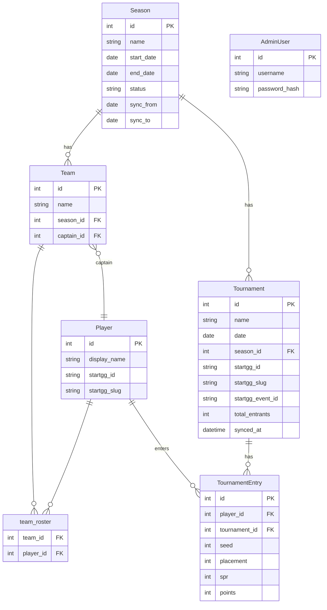
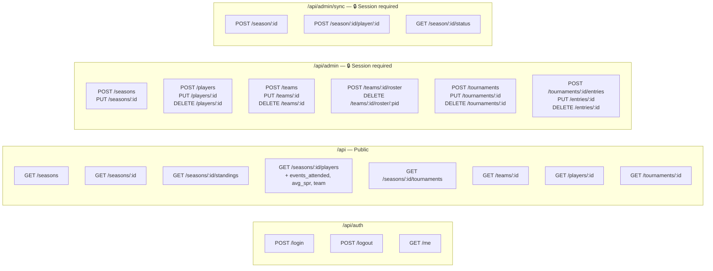
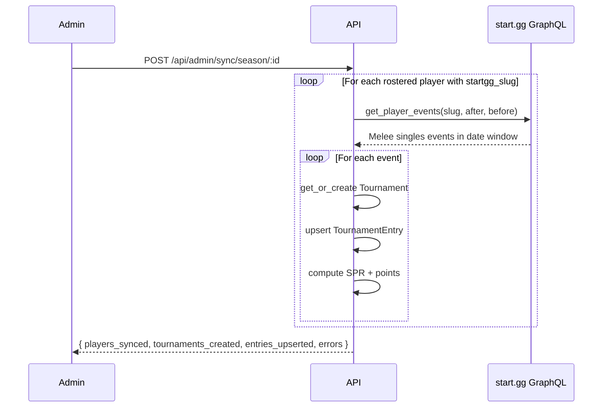
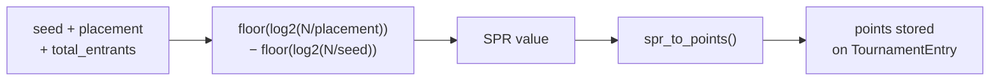
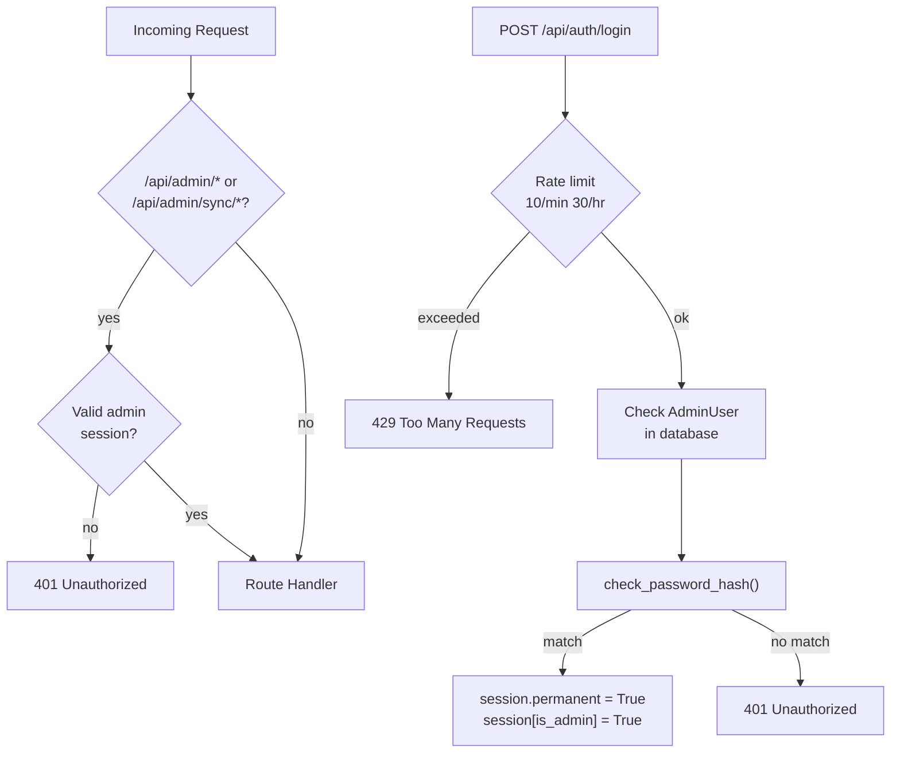
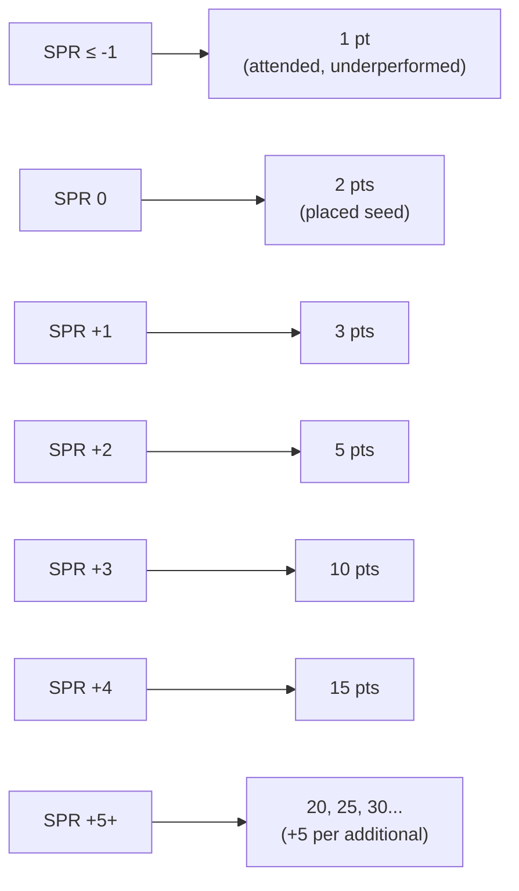

## Data Model

```mermaid
erDiagram
    Season {
        int id PK
        string name
        date start_date
        date end_date
        string status
        date sync_from
        date sync_to
    }

    Team {
        int id PK
        string name
        int season_id FK
        int captain_id FK
    }

    Player {
        int id PK
        string display_name
        string startgg_id
        string startgg_slug
    }

    team_roster {
        int team_id FK
        int player_id FK
    }

    Tournament {
        int id PK
        string name
        date date
        int season_id FK
        string startgg_id
        string startgg_slug
        string startgg_event_id
        int total_entrants
        datetime synced_at
    }

    TournamentEntry {
        int id PK
        int player_id FK
        int tournament_id FK
        int seed
        int placement
        int spr
        int points
    }

    AdminUser {
        int id PK
        string username
        string password_hash
    }

    Season ||--o{ Team : "has"
    Season ||--o{ Tournament : "has"
    Team }o--|| Player : "captain"
    Team ||--o{ team_roster : ""
    Player ||--o{ team_roster : ""
    Player ||--o{ TournamentEntry : "enters"
    Tournament ||--o{ TournamentEntry : "has"
```

## API Routes

```mermaid
graph LR
    subgraph Auth ["/api/auth"]
        AU1["POST /login"]
        AU2["POST /logout"]
        AU3["GET /me"]
    end

    subgraph Public ["/api — Public"]
        S1["GET /seasons"]
        S2["GET /seasons/:id"]
        S3["GET /seasons/:id/standings"]
        S4["GET /seasons/:id/players\n+ events_attended, avg_spr, team"]
        S5["GET /seasons/:id/tournaments"]
        T1["GET /teams/:id"]
        P1["GET /players/:id"]
        TN1["GET /tournaments/:id"]
    end

    subgraph Admin ["/api/admin — 🔒 Session required"]
        AS["POST /seasons\nPUT /seasons/:id"]
        AP["POST /players\nPUT /players/:id\nDELETE /players/:id"]
        AT["POST /teams\nPUT /teams/:id\nDELETE /teams/:id"]
        AR["POST /teams/:id/roster\nDELETE /teams/:id/roster/:pid"]
        ATN["POST /tournaments\nPUT /tournaments/:id\nDELETE /tournaments/:id"]
        AE["POST /tournaments/:id/entries\nPUT /entries/:id\nDELETE /entries/:id"]
    end

    subgraph Sync ["/api/admin/sync — 🔒 Session required"]
        SY1["POST /season/:id"]
        SY2["POST /season/:id/player/:id"]
        SY3["GET /season/:id/status"]
    end
```

## Sync Flow

```mermaid
sequenceDiagram
    participant Admin
    participant API
    participant startgg as start.gg GraphQL

    Admin->>API: POST /api/admin/sync/season/:id
    loop For each rostered player with startgg_slug
        API->>startgg: get_player_events(slug, after, before)
        startgg-->>API: Melee singles events in date window
        loop For each event
            API->>API: get_or_create Tournament
            API->>API: upsert TournamentEntry
            API->>API: compute SPR + points
        end
    end
    API-->>Admin: { players_synced, tournaments_created, entries_upserted, errors }
```

## SPR Calculation

```mermaid
graph LR
    IN["seed + placement\n+ total_entrants"] --> CALC["floor(log2(N/placement))\n− floor(log2(N/seed))"]
    CALC --> SPR["SPR value"]
    SPR --> PTS["spr_to_points()"]
    PTS --> STORED["points stored\non TournamentEntry"]
```

## File Structure

```mermaid
graph TD
    root["Resonance-App/"]
    run["run.py"]
    req["requirements.txt"]
    env[".env"]
    gitignore[".gitignore"]

    api["api/"]
    init["__init__.py\n(factory, CLI, security headers)"]
    ext["extensions.py\n(db, limiter)"]
    dec["decorators.py\n(require_admin hook)"]
    utils["utils.py\n(calculate_spr, spr_to_points)"]
    sg["startgg.py\n(GraphQL client)"]
    sync_logic["sync.py\n(season/player sync logic)"]
    models["models/"]
    routes["routes/"]

    m_season["season.py"]
    m_player["player.py"]
    m_team["team.py + team_roster"]
    m_tournament["tournament.py"]
    m_entry["entry.py"]
    m_admin["admin_user.py"]

    r_public["public.py\n(read-only)"]
    r_admin["admin.py\n(CRUD)"]
    r_sync["sync.py\n(start.gg sync)"]
    r_auth["auth.py\n(login/logout/me)"]

    client["client/"]
    src["src/"]
    c_app["App.jsx\n(auth state, data fetch)"]
    c_header["Header.jsx + AdminLogin.jsx"]
    c_lb["Leaderboard.jsx"]
    c_about["About.jsx"]
    c_ta["TournamentAdmin.jsx\n(admin only)"]

    root --> run
    root --> req
    root --> env
    root --> gitignore
    root --> api
    root --> client

    api --> init
    api --> ext
    api --> dec
    api --> utils
    api --> sg
    api --> sync_logic
    api --> models
    api --> routes

    models --> m_season
    models --> m_player
    models --> m_team
    models --> m_tournament
    models --> m_entry
    models --> m_admin

    routes --> r_public
    routes --> r_admin
    routes --> r_sync
    routes --> r_auth

    client --> src
    src --> c_app
    src --> c_header
    src --> c_lb
    src --> c_about
    src --> c_ta
```

## Security

```mermaid
graph TD
    REQ["Incoming Request"]
    REQ --> AUTH_CHECK{"/api/admin/* or\n/api/admin/sync/*?"}
    AUTH_CHECK -->|yes| SESSION{Valid admin\nsession?}
    SESSION -->|no| R401["401 Unauthorized"]
    SESSION -->|yes| HANDLER["Route Handler"]
    AUTH_CHECK -->|no| HANDLER

    LOGIN["POST /api/auth/login"]
    LOGIN --> RATE{Rate limit\n10/min 30/hr}
    RATE -->|exceeded| R429["429 Too Many Requests"]
    RATE -->|ok| DBCHECK["Check AdminUser\nin database"]
    DBCHECK --> HASH["check_password_hash()"]
    HASH -->|match| SESSION_SET["session.permanent = True\nsession[is_admin] = True"]
    HASH -->|no match| R401b["401 Unauthorized"]
```

## Points System (SPR → Points)

```mermaid
graph LR
    A["SPR ≤ -1"] --> P1["1 pt\n(attended, underperformed)"]
    B["SPR 0"]    --> P2["2 pts\n(placed seed)"]
    C["SPR +1"]   --> P3["3 pts"]
    D["SPR +2"]   --> P4["5 pts"]
    E["SPR +3"]   --> P5["10 pts"]
    F["SPR +4"]   --> P6["15 pts"]
    G["SPR +5+"]  --> P7["20, 25, 30...\n(+5 per additional)"]
```
